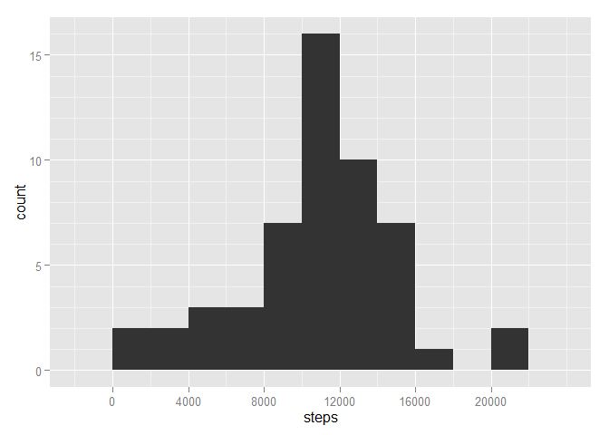
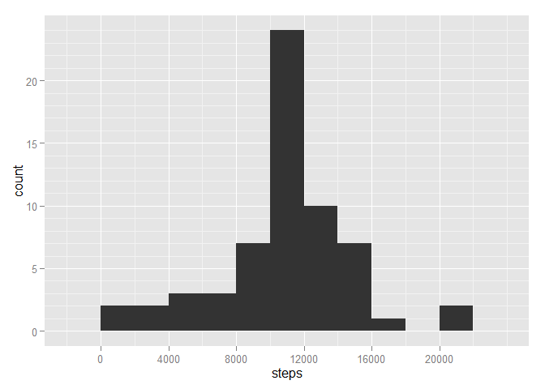
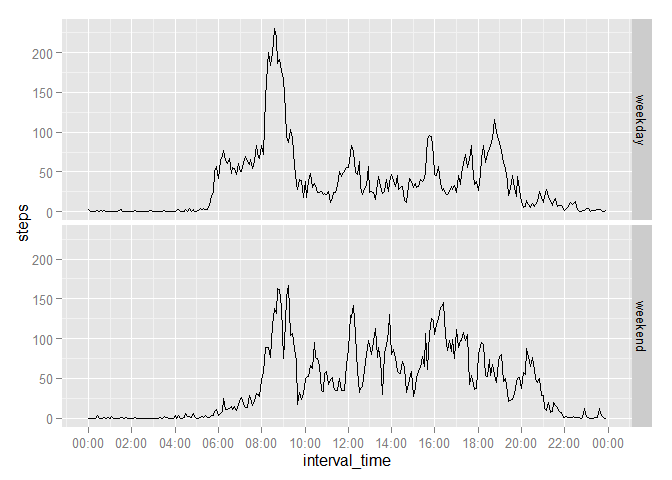

# Reproducible Research: Peer Assessment 1

In this assignment, we'll use the data which consists of two months of data from an anonymous individual collected during the months of October and November, 2012 and include the number of steps taken in 5 minute intervals each day.

The dataset is stored in a comma-separated-value (CSV) file and there are a total of 17,568 observations.


## Loading and preprocessing the data

The following packages are used to produce this report:


```r
library(ggplot2)
library(knitr)
library(scales)
```

Read the provided dataset:


```r
data <- read.csv(unz("activity.zip", "activity.csv"), colClasses = c("numeric", 
    "Date", "numeric"))
```

## What is mean total number of steps taken per day?

First the total number of steps is calculated for each day, and the histogram represents its distribution.  Days without data are not represented for this part of the report.  In fact, the processing step implicitly ignored missing data.


```r
daily <- aggregate(steps ~ date, data = data, FUN = sum)

hist1 <- qplot(steps, data = daily, binwidth = 2000)
hist1 + scale_y_continuous(breaks = seq(0, 16, 5), minor_breaks = seq(0, 16, 
    1)) + scale_x_continuous(breaks = seq(0, 20000, 4000))
```

 

The mean of the total number of steps per day is calculated to be 10766 steps, as below:


```r
mean(daily$steps)
```

```
## [1] 10766.19
```
The median of the total number of steps per day is calculated to be 10765 steps, as below:


```r
median(daily$steps)
```

```
## [1] 10765
```

## What is the average daily activity pattern?

The total number of steps, while previously summed for each day, is now summed for each 5-minute interval across all days with valid data.


```r
daily2 <- aggregate(steps ~ interval, data = data, FUN = mean)
daily2 <- transform(daily2, interval_time = strptime(sprintf("%04d", interval), 
    "%H%M"))
tseries <- qplot(interval_time, steps, data = daily2, geom = "line")
tseries + scale_x_datetime(breaks = "2 hours", labels = date_format("%H:%M"))
```

 

The 5-minute time interval of the day with the highest average number of steps is from 8:35 AM to 8:40 AM, at 206.2 steps.


```r
daily2[which.max(daily2$steps), c(1, 2)]
```

```
##     interval    steps
## 104      835 206.1698
```
## Imputing missing values

To analyze the missing data, a boolean array is created to mark the NA's, and summing it reveals that there are 2304 missing values.


```r
na_index = is.na(data$steps)
sum(na_index)
```

```
## [1] 2304
```

Additionally, by examining the number of missing values for each day, it appears that the value is either complete, or completely missing for each day.  There are 8 days with no data.


```r
sapply(split(data, data$date), function(x) sum(is.na(x$steps)))
```

```
## 2012-10-01 2012-10-02 2012-10-03 2012-10-04 2012-10-05 2012-10-06 
##        288          0          0          0          0          0 
## 2012-10-07 2012-10-08 2012-10-09 2012-10-10 2012-10-11 2012-10-12 
##          0        288          0          0          0          0 
## 2012-10-13 2012-10-14 2012-10-15 2012-10-16 2012-10-17 2012-10-18 
##          0          0          0          0          0          0 
## 2012-10-19 2012-10-20 2012-10-21 2012-10-22 2012-10-23 2012-10-24 
##          0          0          0          0          0          0 
## 2012-10-25 2012-10-26 2012-10-27 2012-10-28 2012-10-29 2012-10-30 
##          0          0          0          0          0          0 
## 2012-10-31 2012-11-01 2012-11-02 2012-11-03 2012-11-04 2012-11-05 
##          0        288          0          0        288          0 
## 2012-11-06 2012-11-07 2012-11-08 2012-11-09 2012-11-10 2012-11-11 
##          0          0          0        288        288          0 
## 2012-11-12 2012-11-13 2012-11-14 2012-11-15 2012-11-16 2012-11-17 
##          0          0        288          0          0          0 
## 2012-11-18 2012-11-19 2012-11-20 2012-11-21 2012-11-22 2012-11-23 
##          0          0          0          0          0          0 
## 2012-11-24 2012-11-25 2012-11-26 2012-11-27 2012-11-28 2012-11-29 
##          0          0          0          0          0          0 
## 2012-11-30 
##        288
```

Imputing for missing data, the average of that 5-minutes interval is used to fill in, which was calculated in the last section.  For example, in the very first row, 2012-10-01, interval 0, steps count is missing.  Filling in will be the average number of steps in interval 0 for every day where the interval 0 steps count is available.


```r
imputed <- data
imputed[na_index, "steps"] <- rep(daily2$steps, length.out = nrow(data))[na_index]
```

Following the same proceduce as before, a daily sum is computed, with a histogram generated below:


```r
daily_imputed <- aggregate(steps ~ date, data = imputed, FUN = sum)
hist2 <- qplot(steps, data = daily_imputed, binwidth = 2000)
hist2 + scale_y_continuous(breaks = seq(0, 24, 5), minor_breaks = seq(0, 24, 
    1)) + scale_x_continuous(breaks = seq(0, 20000, 4000))
```

 

Since we're only replacing the missing data with the existing average, and that missing values appear in groups of entire days (i.e. either a whole day of data is missing, or no data is missing), the above histogram shows that after imputing, those days originally missing data now have a total steps number equal to the average number of total steps in a day.


```r
mean(daily_imputed$steps)
```

```
## [1] 10766.19
```


```r
median(daily_imputed$steps)
```

```
## [1] 10766.19
```

This method of imputing data does not affect the estimation of the total number of steps taken each day.  That is, the mean of total steps per day is unchanged.  On the other hand, the median has changed and is now equal to the mean, because there are now a few days with steps sum equal to the mean.

## Are there differences in activity patterns between weekdays and weekends?

A new factor variable is added to the imputed data set to indicate whether a given date is a weekday or a weekend day.


```r
imputed$weekend <- as.numeric(format(imputed$date, "%u"))
imputed[imputed$weekend > 5, "weekend"] <- "weekend"
imputed[imputed$weekend != "weekend", "weekend"] <- "weekday"
imputed$weekend <- as.factor(imputed$weekend)
```


The following time series plot shows the average number of steps taken during each time interval, separately for weekday/weekend.


```r
imputed <- transform(imputed, interval_time = strptime(sprintf("%04d", interval), 
    "%H%M"))

tseries2 <- ggplot(imputed, aes(interval_time, steps))
tseries2 + stat_summary(fun.y = "mean", geom = "line") + facet_grid(weekend ~ 
    .) + scale_x_datetime(breaks = "2 hours", labels = date_format("%H:%M"))
```

 
